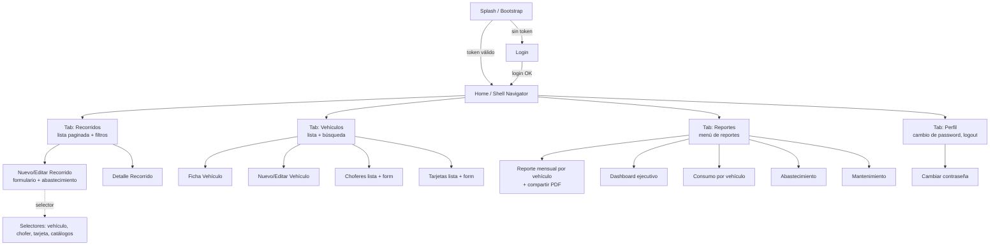
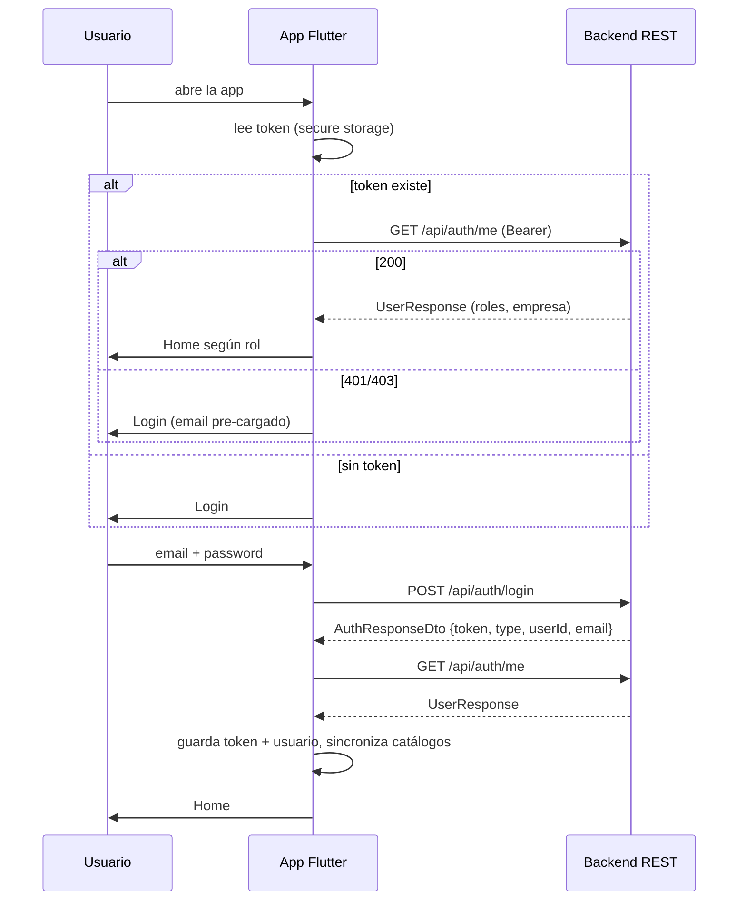
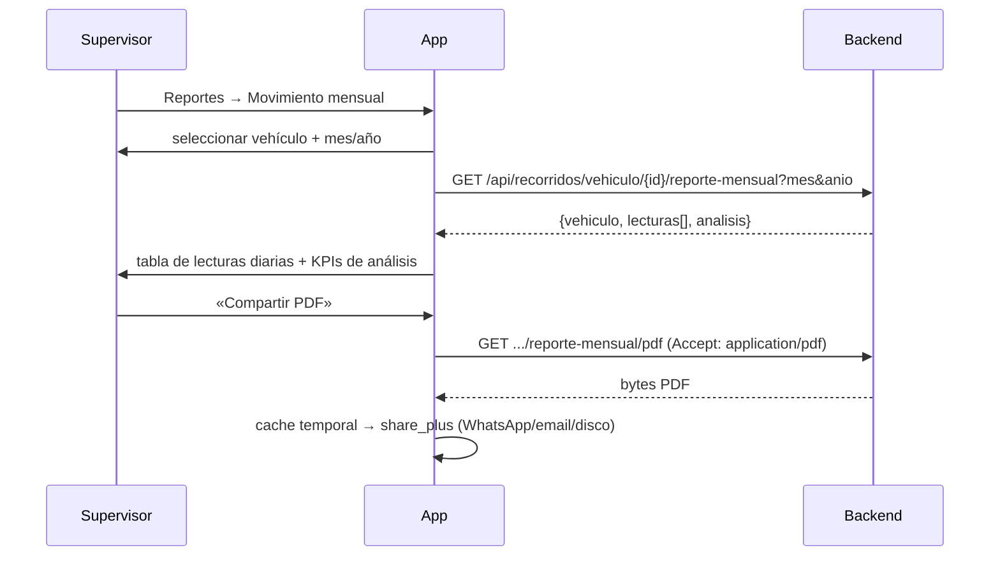

# Plan de Desarrollo — APK Flutter «Registro de Recorridos de Vehículos»

> **Rol**: Desarrollo móvil senior (Flutter)
> **Versión del documento**: 1.0
> **Fuente de contratos de API**: `api-docs.json` (OpenAPI 3.1 — backend Spring Boot, servidor base `http://localhost:8081`)
> **Objetivo**: definir requisitos, flujos, arquitectura y el roadmap de construcción por componentes de la APK móvil para el registro de los recorridos realizados por los vehículos de una empresa de transporte.

---

## 1. Visión del producto

Aplicación móvil (Android/iOS, prioridad Android/APK) que permite a los **choferes** registrar diariamente los recorridos de sus vehículos (kilometraje y abastecimientos de combustible con chip/tarjeta) y a los **supervisores/jefes de transporte** gestionar la flota (vehículos, choferes, tarjetas) y consultar reportes operativos (consumo, abastecimiento, mantenimiento, movimiento mensual con exportación a PDF).

**Dominio detectado en la API**: gestión de flota multiempresa (`Empresa`), con catálogos regionales (`Provincia`, `Municipio`), normas de consumo (`indiceConsumo` por vehículo), control de combustible por chip/tarjeta y auditoría completa (`creadoPor`/`modificadoPor`).

### 1.1 Personas y roles

| Persona | Perfil | Capacidades en la APK |
|---|---|---|
| **Chofer** | Usuario operativo en ruta | Registrar sus recorridos y abastecimientos, ver su historial, ver datos de su vehículo asignado |
| **Jefe de transporte / Supervisor** | Usuario de despacho | CRUD de recorridos, CRUD de vehículos/choferes/tarjetas, reportes mensuales, reportes de transporte |
| **Administrador de empresa** | Gestor | Todo lo anterior + Dashboard ejecutivo, cambio de contraseña, consulta de usuarios de su empresa (solo lectura) |

> Los catálogos maestros globales (marcas, tipos de vehículo, tipos de combustible, provincias, monedas, planes/suscripciones, roles/permisos) se **consumen en modo lectura** desde la APK. Su administración queda en el back-office web. `Users`, `Roles`, `Permissions`, `Plans`, `Features`, `Subscriptions` → **fuera del MVP móvil** (solo se usan implícitamente vía `/api/auth/me`).

---

## 2. Análisis de la API (`api-docs.json`)

### 2.1 Mapa de endpoints relevantes para la APK

| Módulo API | Endpoints clave | Uso en la app |
|---|---|---|
| **Authentication** | `POST /api/auth/login` → `AuthResponseDto{token,type,userId,email}` · `GET /api/auth/me` → `UserResponse` (roles, empresa) · `POST /api/auth/logout` · `PUT /api/auth/cambiar-password` | Sesión JWT, bootstrap de usuario, cambio de contraseña |
| **Trips (Recorridos)** ★ núcleo | `GET /api/recorridos?page&perPage&sort&sortOrder` → `PageRecorridoResponse` · `POST /api/recorridos` · `GET/PUT/DELETE /api/recorridos/{id}` · `GET /api/recorridos/vehiculo/{vehiculoId}` · `GET /api/recorridos/vehiculo/{vehiculoId}/reporte-mensual?mes&anio` · `.../reporte-mensual/pdf` | Registro y historial de recorridos; reporte de movimiento mensual (lecturas diarias + análisis de consumo) y su PDF |
| **Vehicles** | `GET /api/vehiculos?filter&page&perPage…` · `POST`, `GET/PUT/DELETE /{id}` · `/chofer/{choferId}` · `/empresa/{empresaId}` · `/sin-chofer` · `/tipo-vehiculo/{id}` · `/tipo-combustible/{id}` · `/reporte-pdf` · `/reporte-movimiento-mensual/{vehiculoId}` | Flota del usuario, asignación chofer↔vehículo, reportes por vehículo |
| **Drivers (Choferes)** | `GET /api/choferes` (paginado) · `POST` · `GET/PUT/DELETE /{id}` · `/empresa/{empresaId}` · `GET /api/choferes-categorias/chofer/{choferId}` + `POST /api/choferes-categorias` · `GET /api/categorias-licencia` | Gestión de choferes con licencias y categorías |
| **Fuel Cards** | `GET /api/tarjetas-combustible` · `POST` · `GET/PUT/DELETE /{id}` · `/empresa/{empresaId}` · `/numero/{numero}` | Tarjetas asociadas a abastecimientos |
| **Reportes Transporte** | `GET /dashboard-ejecutivo?mes&anio` · `GET /consumo-vehiculo?fechaDesde&fechaHasta&…&page&size` · `GET /consumo-por-combustible?fechaDesde&fechaHasta` · `GET /abastecimiento?desde&hasta&vehiculoId&lugarAbastecimiento&page&size` · `GET /mantenimiento?page&size` | Dashboard y reportes gerenciales |
| **Catálogos (solo lectura)** | `tipos-vehiculo` · `tipos-combustible` (+`/codigo/{codigo}`) · `marcas` · `provincias` · `municipios/provincia/{provinciaId}/list` · `currencies/iso-code/{isoCode}` · `empresas` (+`/codigo/{codigo}`) | Poblar dropdowns y formularios |

### 2.2 Contratos de datos relevantes

- **`RecorridoRequest`** (required: `fecha`, `kilometros`, `vehiculoId`; opcionales: `choferId`, `litrosAbastecidos`, `numeroChip` ≤50, `lugarAbastecimiento` ≤100, `tarjetaCombustibleId`, `importeAbastecido`).
- **`RecorridoResponse`** añade calculados por el servidor: `odometroInicial`, `combustibleInicial`, `consumo`, `activo`, auditoría (`creadoPor`/`modificadoPor`).
- **`VehiculoRequest`** (required: `empresaId`, `tipoVehiculoId`, `marcaId`, `tipoCombustibleId`, `matricula`, `numeroMotor`, `odometro`, `combustible`).
- **`ChoferRequest`** incluye `categorias: [{categoriaLicenciaId, fechaEmision}]`.
- **Paginación estilo Spring**: `{content, totalElements, totalPages, number, size, first, last, empty}` con parámetros `page`, `perPage` (ojo: los reportes usan `size`).
- **Fechas**: `date` = `yyyy-MM-dd`; `date-time` = ISO-8601 UTC.

### 2.3 Vacíos y riesgos de contrato detectados (a acordar con el backend)

| # | Hallazgo | Impacto | Mitigación |
|---|---|---|---|
| R1 | El OpenAPI **no declara `securitySchemes`** ni header de auth | Riesgo de integración | Asumir `Authorization: Bearer <token>` (el login devuelve `token` + `type`). Validar con Postman el primer día del Sprint 1 |
| R2 | **Sin esquemas de error** (4xx/5xx sin `schema`) | Manejo de errores ambiguo | Parser tolerante: intentar `ProblemDetail` RFC-7807, luego `{message}`, luego cuerpo plano. Sesión de alineación con backend |
| R3 | **No existe refresh-token**: solo login/logout | Sesiones caducan → re-login | UX de sesión expirada con re-login rápido (email pre-cargado). Proponer al backend un refresh token (backlog API) |
| R4 | No hay endpoint de recorridos por rango de fechas ni por empresa (solo global paginado y por vehículo) | Consultas «hoy»/«mis recorridos» pueden ser costosas | Usar `GET /api/recorridos/vehiculo/{vehiculoId}` + cache local Drift; proponer endpoint `GET /api/recorridos?empresaId&fechaDesde&fechaHasta` (backlog API) |
| R5 | Inconsistencia `perPage` vs `size` en paginación | Bugs sutiles | Encapsular en `PageParams` del cliente HTTP |
| R6 | `DELETE` responde `200` (no `204`) | — | Tratar cuerpo vacío como éxito |
| R7 | El servidor calcula `odometroInicial`/`consumo` — el cliente solo envía `kilometros` | Validación de continuidad de odómetro no visible | Mostrar en UI el odómetro esperado (último recorrido + cache); el servidor es la fuente de verdad |
| R8 | `importeAbastecido`/`saldo` son `double` | Errores de redondeo monetario | Manejo con `Decimal` (paquete `decimal2`) en dominio; formateo `intl` |

---

## 3. Requisitos

### 3.1 Requisitos funcionales (RF)

**RF-01 · Autenticación y sesión**
- RF-01.1: login con email + contraseña (`POST /api/auth/login`).
- RF-01.2: persistencia segura del token (`flutter_secure_storage`); auto-login al abrir la app.
- RF-01.3: `GET /api/auth/me` al arrancar → perfil, empresa y roles; la app habilita features según roles.
- RF-01.4: logout (`POST /api/auth/logout`) con limpieza de credenciales y cache.
- RF-01.5: cambio de contraseña (`PUT /api/auth/cambiar-password`) con validaciones de igualdad y longitud.
- RF-01.6: manejo de sesión expirada (401) → pantalla de re-login con mensaje claro.

**RF-02 · Registro de recorridos (núcleo del negocio)**
- RF-02.1: formulario de registro con: vehículo (pre-seleccionado si el usuario es chofer con vehículo asignado), chofer, fecha (default hoy), kilómetros recorridos.
- RF-02.2: bloque opcional de **abastecimiento**: litros, número de chip, lugar de abastecimiento, tarjeta de combustible (selector con saldo visible), importe.
- RF-02.3: validaciones de cliente: `kilometros ≥ 1`, `litros ≥ 0`, fecha ≤ hoy, longitud máxima de campos; advertencia si los km difieren fuertemente del odómetro esperado (R7).
- RF-02.4: listado paginado de recorridos (pull-to-refresh, paginación infinita, orden por fecha DESC).
- RF-02.5: detalle del recorrido con datos calculados (odómetro inicial, consumo, auditoría).
- RF-02.6: edición y borrado (con confirmación y solo según rol; el borrado normalmente será lógico vía `activo`).
- RF-02.7: historial filtrable por vehículo propio/asignado; búsqueda rápida por matrícula/chofer.

**RF-03 · Vehículos**
- RF-03.1: listado con búsqueda (`filter`), paginado; ficha completa (matrícula, marca/modelo, tipo, combustible, odómetro, índice de consumo, chofer asignado, mantenimiento).
- RF-03.2: alta/edición de vehículo (rol supervisor): con selectores dependientes de catálogos (marca, tipo vehículo, tipo combustible) y chofer disponible (`/sin-chofer`).
- RF-03.3: indicador visual de **mantenimiento** (km desde último mantenimiento vs umbral, vía reporte).

**RF-04 · Choferes**
- RF-04.1: listado paginado por empresa con búsqueda.
- RF-04.2: alta/edición con datos personales + **categorías de licencia** (multiple-select con fecha de emisión).

**RF-05 · Tarjetas de combustible**
- RF-05.1: listado por empresa con saldo y moneda.
- RF-05.2: alta/edición (número, saldo, moneda).

**RF-06 · Reportes**
- RF-06.1: **reporte de movimiento mensual por vehículo** (mes/año): lecturas diarias (tabla) + análisis de consumo (inicial/recibido/consumido/existencia final/km/consumo según norma).
- RF-06.2: exportación/compartir **PDF** del movimiento mensual (share sheet del SO).
- RF-06.3: **dashboard ejecutivo** (mes/año): costo total combustible, km flota, consumo promedio, utilización, eficiencia choferes, alertas de mantenimiento, variación vs mes anterior.
- RF-06.4: reporte de **consumo por vehículo** (rango de fechas + filtros tipo/marca/combustible, paginado) con desviación teórico vs real.
- RF-06.5: reporte de **abastecimiento** (rango, vehículo, lugar) y de **mantenimiento** (estado, km restantes).
- RF-06.6: gráficos simples (barras/líneas) en dashboard y detalle mensual.

**RF-07 · Experiencia y plataforma**
- RF-07.1: modo **offline-first** para el core: registro de recorridos sin red con **cola de sincronización** automática; banner de estado de conectividad.
- RF-07.2: idioma español (i18n preparada para más idiomas), formato de números/fechas local.
- RF-07.3: tema claro/oscuro (Material 3) con paleta de la empresa.
- RF-07.4: accesibilidad: targets táctiles ≥ 44dp, contraste AA, lectores de pantalla en formularios críticos.
- RF-07.5: seguridad: token en almacenamiento cifrado, sin datos sensibles en logs, bloqueo por inactividad opcional (P2).

### 3.2 Requisitos no funcionales (RNF)

| ID | Categoría | Requisito |
|---|---|---|
| RNF-01 | Rendimiento | Arranque en frigo < 2.5s en gama media; scroll 60fps en listas de 1000+ ítems (listas virtualizadas); respuesta percibida < 100ms en interacciones |
| RNF-02 | Offline | Núcleo (recorridos) usable sin red; sync automática al recuperar conexión con estrategia *last-write-wins + cola FIFO* y resolución de conflictos visible al usuario |
| RNF-03 | Seguridad | JWT en `flutter_secure_storage` (Keychain/Keystore); TLS obligatorio; ofuscación/release con R8; sin PII en logs |
| RNF-04 | Fiabilidad | Crash-free ≥ 99.5% (Sentry); errores de red reintentables con backoff exponencial |
| RNF-05 | Calidad | Cobertura de tests de dominio ≥ 80%; tests de widgets en flujos críticos; `flutter analyze` sin warnings |
| RNF-06 | Mantenibilidad | Clean Architecture; DTOs generados desde `api-docs.json`; CI con build de APK por commit |
| RNF-07 | Compatibilidad | Android API 24+ (Android 7), iOS 13+; pantallas desde 4.7" hasta tablet |
| RNF-08 | Entregable | APK firmada por sabor (`dev`/`staging`/`prod`) + AAB para Play Store |

### 3.3 Fuera de alcance (MVP)

- Administración de usuarios/roles/permisos desde la APK (queda en web admin).
- Gestión SaaS: planes, suscripciones, features, facturación.
- GPS/tracking en tiempo real (la API no expone telemetría; los kilómetros se declaran manualmente).
- Notificaciones push.

---

## 4. Flujos

### 4.1 Mapa de navegación (go_router)



### 4.2 Flujo de autenticación (secuencia)



### 4.3 Flujo negocio — Registro de recorrido (caso de uso principal)

```mermaid
flowchart TD
    S([Inicio: pulsar '+' en Recorridos]) --> P1[Paso 1: Datos del recorrido]
    P1 --> P1a{¿Usuario es chofer\ncon vehículo asignado?}
    P1a -->|Sí| P1b[Vehículo y chofer pre-cargados]
    P1a -->|No| P1c[Seleccionar vehículo → chofer sugerido]
    P1b --> P2{¿Hay red?}
    P1c --> P2
    P2 -->|Sí| P3[Obtener último odómetro\n(último recorrido del vehículo)]
    P2 -->|No| P4[Usar odómetro en cache local\n+ badge 'sin conexión']
    P3 --> F[Formulario: fecha, km, abastecimiento opcional]
    P4 --> F
    F --> V{Validaciones OK?\nkm ≥ 1, fecha ≤ hoy, límites de campos}
    V -->|No| F
    V -->|Sí| O{¿En línea?}
    O -->|Sí| POST[POST /api/recorridos]
    POST --> OK{2xx?}
    OK -->|Sí| SAV[Guardar en Drift como 'synced' + toast éxito]
    OK -->|No 4xx| ERR[Mostrar error del servidor + opción reintentar]
    OK -->|No 5xx/red| QUE[Marcar 'pendiente']
    O -->|No| QUE
    QUE --> QUEUE[Guardar en Drift 'pending' con UUID local\n+ encolar en SyncQueue]
    QUEUE --> HOME[Volver a lista con badge pendiente]
    SAV --> HOME
    ERR --> F
    HOME -.->|restaura conexión| SYNC[SyncWorker: reenvía cola FIFO\nmarca synced, notifica resultados]
```

### 4.4 Flujo — Reporte mensual y PDF



### 4.5 Flujo — Sincronización offline (estrategia)

- **Escritura**: toda mutación se persiste primero en Drift (`outbox` con `idLocal` UUID, payload JSON, operación, estado, intentos). Si hay red se envía inmediatamente; si no, queda en cola.
- **Lectura**: catálogos y listas usadas en formularios se cachean (TTL 24h). Listado de recorridos: *offline-primero desde cache*, refresco en background si hay red.
- **Conflictos**: como el servidor es la fuente de verdad del odómetro/consumo, un `409/422` en sync marca el registro como `conflicto` y ofrece al usuario revisar/editar.
- **Idempotencia**: se incluye header `X-Idempotency-Key` (si el backend lo soporta; de lo contrario, reintentos solo ante errores de red, no ante 4xx).

---

## 5. Arquitectura

### 5.1 Principio general — Clean Architecture + offline-first

```text
┌─────────────────────────────────────────────────────────────┐
│  PRESENTACIÓN (Flutter UI)                                  │
│  pantallas · widgets · view-models (Riverpod Notifiers)     │
├─────────────────────────────────────────────────────────────┤
│  DOMINIO                                                    │
│  entidades (freezed) · casos de uso · interfaces de repos   │
│  · validaciones · failures                                  │
├─────────────────────────────────────────────────────────────┤
│  DATOS                                                      │
│  API remota (Dio + DTOs generados del OpenAPI)              │
│  BD local (Drift/SQLite) · mappers DTO↔Entidad              │
│  · repositorios (implementan interfaces del dominio)        │
│  · SyncManager (outbox)                                     │
└─────────────────────────────────────────────────────────────┘
        Regla de dependencia: exterior → interior. El dominio
        no conoce Dio, Drift ni Flutter.
```

### 5.2 Stack tecnológico y paquetes

| Concern | Elección | Justificación |
|---|---|---|
| Estado + DI | **Riverpod 2** (Notifier/AsyncNotifier) | Testeable, sin BuildContext en lógica, DI nativa por providers |
| HTTP | **Dio** + interceptores (auth, logging, retry, `XTransformPort`-style headers si aplica) | Interceptores para Bearer, refresco de sesión y métricas |
| Código de API | **Generación desde `api-docs.json`** con `openapi_generator` (dart-dio) o `freezed`+`json_serializable` manual para DTOs | El contrato ya existe; generar evita deriva. Opción recomendada: generar DTOs y mapear a entidades del dominio |
| Modelo de dominio | **freezed** + **json_serializable** | Inmutabilidad, `copyWith`, union types para `Failure` |
| BD local | **Drift** (SQLite) | Relacional (recorridos, vehículos, outbox), queries tipadas, migraciones |
| KV seguro | **flutter_secure_storage** | Token JWT en Keystore/Keychain |
| Navegación | **go_router** + guards por sesión/rol | Deep-links simples, redirect a login |
| Fechas/números/i18n | **intl** + **decimal** | `yyyy-MM-dd` ↔ `DateTime`; dinero sin errores de coma flotante |
| Conectividad | **connectivity_plus** | Banner offline + disparador de sync |
| PDF/compartir | **share_plus** + `path_provider` | Compartir PDF del reporte mensual |
| Gráficos | **fl_chart** | Dashboard y análisis mensual |
| Errores | `Either<Failure, T>` (fpdart o propio) + **Sentry** | Manejo funcional de errores y observabilidad |
| Testing | **mocktail**, **flutter_test**, **patrol/integration_test** | Unit + widget + integración E2E |

### 5.3 Estructura de carpetas (feature-first)

```text
lib/
├── main.dart
├── app.dart                      # MaterialApp, tema, router
├── core/
│   ├── config/                   # envs, flavors (dev/staging/prod), api base url
│   ├── network/                  # dio_client, interceptors (auth, retry, logging)
│   ├── error/                    # failures (ApiFailure, NetworkFailure, ValidationFailure…)
│   ├── storage/                  # secure_storage, prefs
│   ├── db/                       # drift: tables, database.dart, daos
│   ├── sync/                     # outbox, sync_manager, connectivity trigger
│   ├── i18n/                     # arb files, l10n
│   ├── theme/                    # tokens de diseño, tema claro/oscuro
│   └── utils/                    # formatters, validators, date_utils
├── features/
│   ├── auth/
│   │   ├── data/  (auth_api, auth_repo_impl, models)
│   │   ├── domain/ (entities, auth_repository, use_cases: login, logout, get_me, change_password)
│   │   └── presentation/ (login_screen, profile_screen, controllers)
│   ├── recorridos/               # ★ núcleo
│   │   ├── data/ (recorridos_api, dto, repo_impl, recorridos_dao)
│   │   ├── domain/ (recorrido.dart, recorrido_repository,
│   │   │            use_cases: crear_recorrido, listar_recorridos,
│   │   │            editar_recorrido, eliminar_recorrido, reporte_mensual)
│   │   └── presentation/ (recorridos_list, recorrido_form, recorrido_detail,
│   │                      controllers, widgets: recorrido_card, abastecimiento_section)
│   ├── vehiculos/
│   ├── choferes/
│   ├── tarjetas/
│   ├── catalogos/                # marcas, tipos, provincias/municipios (lectura + cache)
│   └── reportes/
│       └── presentation/ (dashboard_ejecutivo, consumo_vehiculo, abastecimiento,
│                          mantenimiento, movimiento_mensual)
└── shared/
    ├── widgets/                  # paginated_list, empty_state, error_retry,
    │                             # kpi_card, section_header, offline_banner
    └── models/                   # page<T>, page_params, sort_options
```

### 5.4 Decisiones arquitectónicas clave (ADR resumidos)

| ADR | Decisión | Alternativa descartada | Motivo |
|---|---|---|---|
| ADR-01 | Riverpod como gestor de estado | Bloc | Menos boilerplate para formularios + DI unificada; equipo con curva de aprendizaje menor |
| ADR-02 | DTOs generados desde `api-docs.json` | Escritura manual | El OpenAPI es autoritativo; regenerar con un comando garantiza sincronía con el backend |
| ADR-03 | Drift (SQLite) para cache + outbox | Hive/Isar | Datos relacionales y queries por vehículo/fecha; soporte SQL real para el reporte offline |
| ADR-04 | Servidor = fuente de verdad de odómetro/consumo | Calcular en cliente | El backend ya computa `odometroInicial`, `consumo`; evita divergencia contable |
| ADR-05 | Un solo paquete con feature-first | Monorepo melos multi-paquete | Tamaño del proyecto: complejidad de melos no justificada aún |
| ADR-06 | `Either<Failure,T>` en repositorios | Excepciones | Errores tipados obligan a manejar fallos en UI; se mapean a mensajes i18n |

### 5.5 Seguridad

1. Token Bearer solo en memoria + `flutter_secure_storage`; nunca en `SharedPreferences`.
2. Interceptor de logging activo solo en `dev`; en `release`, sanitizado.
3. Certificado pinning (fase 2, si el backend publica SPKI).
4. `android:allowBackup=false`, `usesCleartextTraffic=false`; iOS Keychain con `accessibilityWhenUnlocked`.
5. Ofuscación R8/ProGuard + `--obfuscate --split-debug-info` en builds release.

---

## 6. Roadmap de construcción por componentes (para evaluar paso a paso)

> Estimaciones en **días-ideal (DI)** de un desarrollador Flutter senior (1 DI = 1 día productivo sin reuniones). MVP total ≈ **55–70 DI** (~10–12 semanas con 1 senior + 1 mid, o ~7–8 semanas con 2 devs dedicados).

### FASE 0 — Cimientos (Semana 1) · ~6 DI

| # | Componente | Entregable | Criterio de aceptación |
|---|---|---|---|
| 0.1 | Proyecto + flavors | Repo, `dev/staging/prod`, lint (very_good_analysis o flutter_lints estricto), CI básico | `flutter analyze` limpio; APK dev genera build en CI |
| 0.2 | Diseño del sistema | Tokens de tema (color, tipografía, espaciado), componentes compartidos base (`KpiCard`, `AppButton`, `AppTextField`, `EmptyState`, `ErrorRetry`, `OfflineBanner`, `PaginatedList<T>`) | Storyboard de pantallas clave maquetado con datos falsos |
| 0.3 | Infraestructura de datos | `DioClient` (interceptors auth/retry/log), `Failure` hierarchy, `Page<T>`/`PageParams` | Test unitario del interceptor 401 → evento de sesión expirada |
| 0.4 | Generación DTOs | Script `make api` que regenera DTOs desde `api-docs.json` + mappers | DTOs de `Recorrido`, `Vehiculo`, `Chofer`, `AuthResponse` compilan y parsean un fixture real |
| 0.5 | Drift + esquema | Tablas: `recorridos_cache`, `vehiculos_cache`, `catalogos`, `outbox`, `meta` | Migraciones v1; tests de DAO |

### FASE 1 — Autenticación y sesión (Semana 2) · ~5 DI

| # | Componente | Detalle |
|---|---|---|
| 1.1 | `AuthRepository` + use cases | `login`, `logout`, `getMe`, `cambiarPassword`; token en secure storage |
| 1.2 | `SessionController` (Riverpod) | Estados: `unknown → authenticated(user) → unauthenticated(reason)`; guard de go_router |
| 1.3 | UI Login + Splash | Validación de formularios, estados loading/error, email pre-cargado tras expiración |
| 1.4 | Perfil y cambio de contraseña | Formularios con validaciones de igualdad/longitud |
| **Gate F1** | **Smoke test E2E**: login real contra staging → Home → logout | Verifica R1 (Bearer) y formato de errores R2 con el backend real |

### FASE 2 — Núcleo: Recorridos (Semanas 3–4) · ~12 DI ★ valor de negocio

| # | Componente | Detalle |
|---|---|---|
| 2.1 | Catálogos cacheados | Providers de tipos/marcas/provincias/municipios con cache Drift TTL 24h (base de todos los formularios) |
| 2.2 | `RecorridosRepository` | CRUD remoto + cache local; `listar(vehiculoId?, page)`; mapeo Spring `Page` |
| 2.3 | Lista de recorridos | Paginación infinita, pull-to-refresh, orden fecha DESC, estados vacío/error, filtro por vehículo |
| 2.4 | Formulario nuevo recorrido | Paso 1 datos + abastecimiento opcional expandible; selectores dependientes (vehículo→chofer, tarjeta con saldo); validaciones RF-02.3; advertencia de odómetro esperado |
| 2.5 | Outbox + SyncManager v1 | Guardar offline → cola FIFO → reenvío con connectivity trigger; badges de estado (synced/pending/error) |
| 2.6 | Detalle y edición | Muestra calculados del servidor (`odometroInicial`, `consumo`, auditoría); editar/borrar con confirmación |
| **Gate F2** | **Demo end-to-end offline**: registrar 3 recorridos sin red → recuperar conexión → sync → verificar en backend | Tests de dominio (validaciones) + widget tests del formulario ≥ 80% |

### FASE 3 — Flota: Vehículos, Choferes, Tarjetas (Semanas 5–6) · ~12 DI

| # | Componente | Detalle |
|---|---|---|
| 3.1 | Vehículos: lista + ficha | Búsqueda `filter`, paginado, ficha con todos los datos e indicador de mantenimiento |
| 3.2 | Vehículos: alta/edición (rol supervisor) | Formulario completo RF-03.2 con validaciones de campos requeridos del `VehiculoRequest` |
| 3.3 | Choferes: lista + alta/edición | Incluye gestión de categorías de licencia (add/remove con fecha emisión) |
| 3.4 | Tarjetas: lista + alta/edición | Moneda via `currencies/iso-code`, saldo con `Decimal` |
| 3.5 | Asignación chofer↔vehículo | Usa `/sin-chofer` + update del vehículo; flujo con confirmación |
| **Gate F3** | CRUD completo demostrable en staging + permisos verificados por rol | |

### FASE 4 — Reportes y dashboard (Semanas 7–8) · ~12 DI

| # | Componente | Detalle |
|---|---|---|
| 4.1 | Dashboard ejecutivo | KPIs (`DashboardEjecutivoResponse`) en tarjetas + selector mes/año + gráficos fl_chart |
| 4.2 | Movimiento mensual por vehículo | Tabla de lecturas diarias + análisis (comparativo vs norma de consumo) |
| 4.3 | Compartir PDF | Descarga binaria + `share_plus`; manejo de progreso/errores |
| 4.4 | Consumo por vehículo | Filtros rango/tipo/marca/combustible, tabla paginada, semáforo de desviación % |
| 4.5 | Abastecimiento y mantenimiento | Listados paginados con filtros; estado de mantenimiento con color |
| **Gate F4** | Todos los reportes del API consumidos y validados contra datos de staging | |

### FASE 5 — Hardening, QA y release (Semanas 9–10) · ~10–14 DI

| # | Componente | Detalle |
|---|---|---|
| 5.1 | Observabilidad | Sentry + métricas de sync (éxitos/fallos/conflictos) |
| 5.2 | Pulido UX | Animaciones Framer-like sutiles (Hero, implicit), haptic feedback, empty states ilustrados |
| 5.3 | Accesibilidad + i18n | Semántica, targets ≥ 44dp, revisión contraste; `intl` completo |
| 5.4 | Tests de integración E2E | Flujos críticos: login → registrar recorrido → sync → ver en lista; reporte mensual + PDF |
| 5.5 | Release | Firma de APK/AAB, `--obfuscate --split-debug-info`, store listing, distribución interna (Firebase App Distribution o similar) |

### Backlog post-MVP (priorizado)

1. Endpoint API `recorridos?fechaDesde&fechaHasta&empresaId` (propuesta al backend, R4).
2. Refresh token (R3) y biometría para re-login.
3. PIN local / bloqueo por inactividad.
4. Exportación local de reportes a Excel/CSV.
5. Escaneo de chip/tarjeta con cámara (OCR) para reducir tipeo.
6. Modo multi-empresa (si el negocio lo requiere; la API ya soporta `empresaId` en la mayoría de recursos).

---

## 7. Modelo de datos del cliente (Drift, resumen)

```text
recorridos_cache(id_local TEXT PK, id_remote INTEGER?, vehiculo_id, chofer_id?,
                 fecha TEXT, kilometros INTEGER, litros REAL?, numero_chip TEXT?,
                 lugar TEXT?, tarjeta_id INTEGER?, importe REAL?,
                 sync_status TEXT synced|pending|error|conflict,
                 error_msg TEXT?, intentos INTEGER, updated_at INTEGER)

vehiculos_cache(id INTEGER PK, json TEXT, fetched_at INTEGER)   -- cache de lista/fichas
catalogos(tipo TEXT, id INTEGER, json TEXT, fetched_at INTEGER, PK(tipo,id))
outbox(id TEXT PK uuid, entidad TEXT, operacion TEXT create|update|delete,
       payload TEXT json, idempotency_key TEXT, estado TEXT, intentos INTEGER,
       created_at INTEGER)
meta(clave TEXT PK, valor TEXT)   -- token_metadata, last_sync, user_cache
```

> Las entidades de dominio (`Recorrido`, `Vehiculo`, `Chofer`, `TarjetaCombustible`, `User`, `LecturaDiaria`, `AnalisisConsumo`…) se modelan con `freezed` y son **independientes** de DTO y filas Drift; los mappers viven en `data/`.

---

## 8. Mapeo API → Casos de uso → Repositorios

| Caso de uso (dominio) | Endpoint(s) | Repositorio |
|---|---|---|
| Login / Logout / Perfil / Cambio password | `POST /auth/login`, `POST /auth/logout`, `GET /auth/me`, `PUT /auth/cambiar-password` | `AuthRepository` |
| Registrar recorrido | `POST /recorridos` | `RecorridosRepository` (+Outbox si offline) |
| Listar recorridos (global / por vehículo) | `GET /recorridos`, `GET /recorridos/vehiculo/{vehiculoId}` | `RecorridosRepository` |
| Editar / eliminar recorrido | `PUT/DELETE /recorridos/{id}` | `RecorridosRepository` (+Outbox) |
| Reporte mensual + PDF | `GET /recorridos/vehiculo/{id}/reporte-mensual`, `.../pdf` | `ReportesRepository` |
| Listar / buscar vehículos | `GET /vehiculos?filter…`, `/vehiculos/empresa/{id}`, `/vehiculos/chofer/{id}`, `/sin-chofer` | `VehiculosRepository` |
| CRUD vehículo | `POST /vehiculos`, `GET/PUT/DELETE /vehiculos/{id}` | `VehiculosRepository` |
| CRUD chofer + licencias | `/choferes…`, `/choferes-categorias…`, `/categorias-licencia` | `ChoferesRepository` |
| CRUD tarjeta combustible | `/tarjetas-combustible…` | `TarjetasRepository` |
| Dashboard ejecutivo | `GET /reportes-transporte/dashboard-ejecutivo` | `ReportesRepository` |
| Consumo por vehículo | `GET /reportes-transporte/consumo-vehiculo` | `ReportesRepository` |
| Consumo por tipo combustible | `GET /reportes-transporte/consumo-por-combustible` | `ReportesRepository` |
| Abastecimiento / Mantenimiento | `GET /reportes-transporte/abastecimiento`, `/mantenimiento` | `ReportesRepository` |
| Catálogos (lectura) | `/tipos-vehiculo`, `/tipos-combustible`, `/marcas`, `/provincias`, `/municipios/provincia/{id}/list`, `/currencies/iso-code/{code}` | `CatalogosRepository` (con cache) |

---

## 9. Calidad, pruebas y CI/CD

**Pirámide de pruebas**
- **Unitarias (dominio)**: validaciones del formulario, use cases, mappers DTO↔entidad, política de reintentos del outbox (objetivo ≥ 80% en `domain/`).
- **Widget**: formularios (errores visibles, estados), lista paginada (scroll infinito, pull-to-refresh), banner offline.
- **Integración/E2E** (patrol o integration_test): flujo login → registro offline → sync → listado; reporte mensual → compartir PDF.
- **De contrato**: fixture JSON de staging contra DTOs generados (detecta deriva del backend).

**CI/CD (GitHub Actions)**
1. `PR`: `flutter analyze` → `flutter test` → build APK dev.
2. `merge a main`: build staging + distribución interna.
3. `tag v*`: build release firmado (AAB + APK), upload a Play Console (internal track).

**Definition of Done (por componente)**
- Código revisado (PR) sin warnings de analyze · tests incluidos · probado offline y online · i18n sin hardcodes · accesible · demostrado en staging ante el equipo.

---

## 10. Riesgos y mitigaciones

| Riesgo | Prob. | Impacto | Mitigación |
|---|---|---|---|
| R1/R2: esquema de auth/errores no documentado | Alta | Alto | Validar Día 1 de F1 con el backend real; parser de errores tolerante; reuniones semanales API↔mobile |
| R3: sin refresh token → re-logins frecuentes | Media | Medio | UX de re-login rápido; proponer refresh al backend |
| R4: sin filtros de rango en `/recorridos` | Media | Medio | Cache local + búsqueda por vehículo; proponer endpoint |
| Datos maestros desactualizados en formularios offline | Media | Bajo | TTL de catálogos + aviso de última actualización |
| Cambios de contrato del OpenAPI | Media | Medio | Regeneración de DTOs en CI + tests de contrato |
| Entrega en dispositivos de gama baja (flota) | Media | Medio | Presupuesto de rendimiento en F0, pruebas en dispositivo mínimo soportado |

---

## 11. Próximos pasos inmediatos (checklist de arranque)

- [ ] Confirmar con backend: esquema Bearer real (R1), formato de errores (R2), CORS/base URL de staging, soporte idempotencia.
- [ ] Crear repositorio Flutter + flavors + CI (Fase 0.1).
- [ ] Generar DTOs desde `api-docs.json` (Fase 0.4) y validar contra respuesta real de `/api/auth/login`.
- [ ] Maquetar las 3 pantallas del flujo crítico (Login, Lista Recorridos, Nuevo Recorrido) con el design system (Fase 0.2).
- [ ] Definir credenciales de prueba y datos semilla de staging (1 empresa, 3 vehículos, 2 choferes, 1 tarjeta).
- [ ] Aprobar este plan y habilitar el arranque de **Fase 0**.

---

*Documento preparado para evaluación iterativa: cada fase termina en un «Gate» demostrable, lo que permite revisar y aprobar los componentes antes de continuar con el siguiente bloque.*
